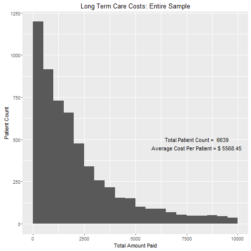

## Aging in the United States

* The population in the United States is aging rapidly. Most people alive today are enjoying much longer lifespans than their ancestors. According to the [Administration on Aging Data](http://www.aoa.acl.gov/Aging_Statistics/future_growth/future_growth.aspx) the aging trend will continue into 2015. 

* Living longer means needing to plan for expenses that were difficult for our ancestors to fathom - such as long term care costs. Long-term care refers to the medical and non-medical care many of us will need as we age and develop chronic illnesses or a disability.

* Home health care and hospice care are prefered methods of long-term care over nursing care due to their person-centered approach. However, according to the [Genworth's Cost of Care Calculator](https://www.genworth.com/corporate/about-genworth/industry-expertise/cost-of-care.html), care costs for home health care are expected to rise an average of 35% in the next 10 years.

--- .class #id 

## Exploring Long Term Care Costs

* One of the issues affecting long-term care costs is the type of agency that is providing care. Due to a lack of standardization across the industry, agencies will charge many different rates for similar services rendered.

* In order to help others have an idea of the current costs for home health care and hospice care by agency type, I developed the Exploring Long Term Care Costs app in Shiny. My hope is that this app will allow others to understand the costs associated with long-term care so they can begin planning for the expense.

--- .class #id 

## How To Use The App
 
* The dataset for the app includes a representitive sample of 6639 patients in the United States who received home health or hospice care from an agency. 

* Simply select the filters you want to see and the app will generate a histogram of the total amount paid by the patient count. The filters availiable to be selected are as follows: 
 + Home Health or Hospice Patient
 + Specialized or Non-Specialized Agency
 + For Profit or Not-For-Profit Status
 + Chain Agency or Not A Chain Agency
 
* In addition, the app will calculate the average cost per patient and the number of patients for the filters you have selected.

--- .class #id 

## Dataset Details

* The data for this app came from the [2007 National Home and Hospice Care Survey](http://www.cdc.gov/nchs/nhhcs/nhhcs_questionnaires.htm). One of the many purposes of this survey was to collect information on the agencies providing home health and hospice care in the United States and how much patients were paying for these services.

* The survey was administered to home health and hospice care agencies by the CDC. A total of 1,545 agencies were selected to be part of the survey. The data for 9416 patients were collected, but cost data was only availiable for the 6639 patients used in the data tool.

--- .class #id 

## Histogram for Total Cost of Care

* For reference while using the app, the cost of care histogram for all the 6639 patients is as follows.

 
